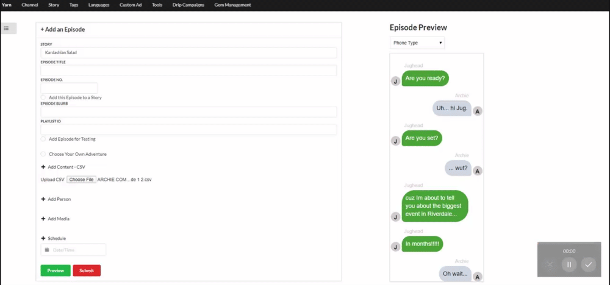
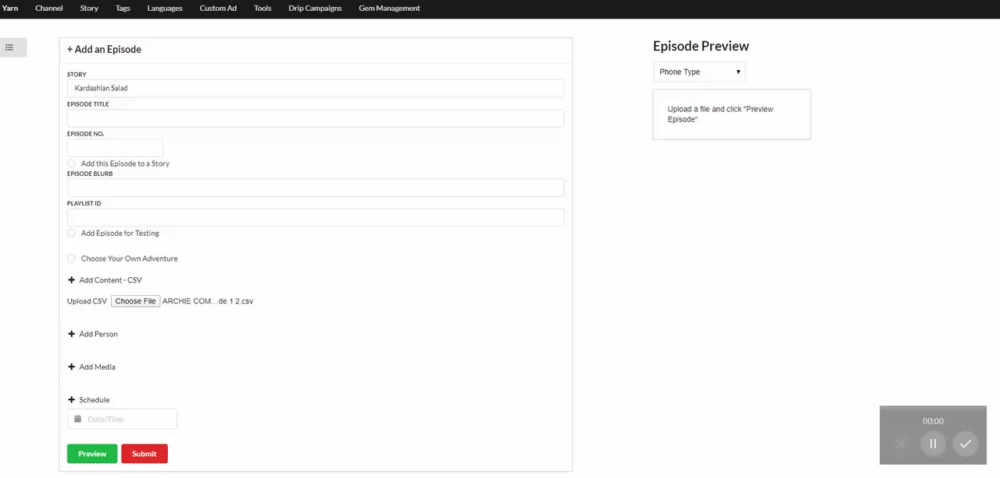

# Yarn Episode Preview

## Motivation

Content team for a mobile application called Yarn is unable to generate an accurate preview of what the story content will look like before it goes live. This application will help make their work flow more efficient and fluid.

Live application can be accessed here.

## Technologies

- CSS Framework: Semantic UI 
- RESTful API routes
- nodeJS
- Javascript
- jQuery for Ajax calls and interface animations

## Dependencies
- 
- Express
- Express-handlebars
- File-system
- Path
- Request

## Scope of functionalities

- Upload csv with characters and story content
- Check for missing characters 
- User notification detailing which characters need to be added to the story before csv can be uploaded
- Generate mobile phone preview that applies correct alignment and color to the different characters
- Dropdown to adjust preview container size based on different phone types
- User friendly menu bar

## Demo

User uploads a csv with existing characters. 

User can change the preview container size to reflect different phone types.

User uploads a csv with missing characters and a modal pops up with the list of missing characters.

## Project Status

We would like to scale the application so that it can be used in any chatStory.

Additional functionalities we would like to implement:

- Image upload
- Image authentification
- Image preview
- Video upload
- Video authentification
- Video preview
- Scheduling enhancements
- Remove csv upload from process

## Contributors

- @prydell
- @stephmarie17
- @alexandramj92
